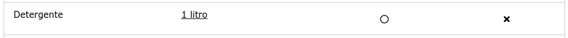

# lista_de_compras

Uma web app muito simples para adquirir experiência em Python e Flask.

Sem querer ainda dei por mim a desenferrujar um pouco as minhas noções
de SQL (ao utilizar uma base de dados sqlite3) e CSS (ao usar os
recursos [W3-CSS](https://www.w3schools.com/w3css/default.asp) para aplicar
estilos aos conteúdos HTML gerados).

Outro bónus inesperado é que quase sem alterações coloquei a web app
a funcionar no [PythonAnywhere.Com](https://pythonanywhere.com/)


## Objectivo

Ter uma página web que mostra uma lista de artigos para comprar,
respectivas quantidades e uma indicação para cada artigo se já foi ou não
comprado.

Esta lista deve ser armazenada numa base de dados local.

Deve ser possível:

- adicionar artigos, especificando a respectiva quantidade
- remover artigos
- marcar artigos como comprados

adicionei uma outra funcionalidade:
- permitir editar quantidades a artigos da lista ainda por comprar


## Preparação

Criar e activar um virtual environment (estou a usar Ubuntu Linux):

```
mkdir lista_de_compras
python -m virtualenv lista_de_compras
source lista_de_compras/bin/activate
```

Instalar as libraries de flask (web server) e sqlite (base de dados):

```
pip install flask
pip install db-sqlite3
```

## Implementação

### começando do zero

Criar uma base de dados em formato sqlite3 chamada 'database.db' com uma única tabela 'ARTIGOS'
com 3 campos:

- 'nome' [TEXT]
- 'quantidade'  [TEXT]
- 'estado' [INTEGER]

(eu usei uma extensão do vscode para o fazer)

'nome' especifica o nome do produto a adquirir, devendo ser único (é feita uma
validação na aplicaação ao adicionar novos artigos mas no schema da base de dados 
não há nada que o impeça)

'quantidade' especifica a quantidade de produto a adquirir [seja ela qual for]

'estado' identifica se o produto já foi comprado ('1') ou não ('0')

Em seguida criar um ficheiro 'app.py' que implementa um web server em flask e gere as conexões
à base de dados.

Finalmente criar uma sub-pasta 'templates' onde ficarão as páginas HTML servidas pela
web app:

- "index.html" - a página principal que mostra a lista
- 'adicionar.html' - um formulário para adicionar um novo artigo à lista
- 'alterarqtd.html' - um formulário para alterar a quantidade pretendida de um artigo
- 'aviso.html' - uma página invocada para passar mensagens (alertas de erros p.ex.)

Podia ser criada também uma outra sub-pasta 'static' contendo ficheiros de estilos (CSS) para
embelezar as páginas mas optei por utilizar [W3-CSS](https://www.w3schools.com/w3css/default.asp)
directamente inline (ou seja é necessário acesso à internet durante a execução do web server).


### aproveitando o github

transferir os ficheiros do github (ou por download ou via git) sendo apenas necessários:
- na pasta da app:
    - app.py
    - database.db   
- na pasta 'templates':
    - os ficheiros .html


## Utilização

Iniciar o web server:

`python app.py`

deverá surgir uma mensagem do género:

```
 * Serving Flask app 'app'
 * Debug mode: off
WARNING: This is a development server. Do not use it in a production deployment. Use a production WSGI server instead.
 * Running on http://127.0.0.1:5000
```

e podemos aceder à web app pelo link [http://127.0.0.1:5000](http://127.0.0.1:5000)


## Explicação


### a aplicação web

A aplicação python propriamente dita reside no ficheiro 'app.py'.

Este ficheiro importa as libraries necessárias (flask e sqlite), define o
nome e o caminho do ficheiro usado para base de dados e implementa
alguns métodos ou funções:


### a página principal

A aplicação usa esta página ('index.html') como página principal,
sendo apresentada quando se invoca o endereço principal ('/') ou endereço '/home'.


É estabelecida uma conexão à base de dados e extraídos todos os items da
tabela ARTIGOS:

```
	connect = sqlite3.connect('database.db')
	cursor = connect.cursor() 
	cursor.execute('SELECT * FROM ARTIGOS') 
	data = cursor.fetchall() 
```

de seguida é usada a template 'index.html' para renderizar os dados

```
	return render_template('index.html', data=data) 
```

esta template limita-se a construir uma tabela HTML com os dados
recebidos, dispostos em 4 colunas:

- 'Produto'
- 'Quantidade'
- 'Comprado'
- 'Remover'

As primeiras duas colunas ('Produto' e 'Qualidade') são preenchidas
com os campos 'nome' e 'quantidade' de cada item vindo da base de dados,
sendo adicionado um link às quantidades para permitir a
sua alteração.

A terceira coluna ('Comprado') é preenchida conforme o valor do campo
'estado' do item - se for '1' exibe um estado 'checked' e se for '0' 
exibe um estado 'not checked' a que acresecenta um link para poder ser
alterado o estado (apenas é possível alterar para 'checked').

Tentei reresentar estes estados ('checked' e 'not checked') de forma visual
sob a forma de ícones [W3-CSS Font Awesome 5](https://www.w3schools.com/icons/icons_reference.asp).

A quarta coluna é sempre preenchida com um link que permite remover o item da
base de dados. Também usa um ícone [W3-CSS Font Awesome 5](https://www.w3schools.com/icons/icons_reference.asp).


### a página de adição de artigos

A aplicação usa esta página ('adicionar.html') para exibir um formulário
HTML quando se que invoca o endereço '/adicionar'.

Enquanto que as páginas normais apenas requerem comandos HTTP de consulta ('GET')
os formulários requerem o upload da informação introduzida nos campos ('POST')
por isso o código python precisa ter em conta qual dos comandos ou métodos foi
invocado para esta página - se 'GET' limita-se a construir o formulário, se 'POST'
precisa de extrair os valores que foram sumetidos:

```
@app.route('/adicionar', methods=['GET', 'POST']) 
def adicionar(): 
	if request.method == 'POST':
		nome = request.form['nome'] 
		quantidade = request.form['quantidade']     
        ...
    else:
		return render_template('adicionar.html') 
```

Este formulário pede dois valores de texto:

- 'Produto'
- 'Quantidade'


Caso ainda não exista nenhum item na base de dados com o mesmo nome,
estes valores são usados para criar um novo item na base de dados
(sempre na tabela ARTIGOS) sendo feito o seguinte mapeamento:

- 'nome' é preenchido com o texto vindo de 'Produto'
- 'quantidade' é preenchido com o texto vindo de 'Quantidade'
- 'estado' é sempre preenchido com '0' (not checked)

```
    with sqlite3.connect('database.db') as compras: 
        cursor = compras.cursor() 
        cursor.execute('INSERT INTO ARTIGOS(nome,quantidade,estado) VALUES (?,?,?)', (nome, quantidade,0))  
        compras.commit()
```

depois do novo artigo ser inserido na base de dados é feito um redirecionamento para
a página principal.

Nota: a validação do nome do artigo é muito básica, limito-me a
verificar se já existe um item com o mesmo nome ignorando as diferenças
de maiúsculas e minúsculas.

Assim:
- 'Leite', 'leite' e 'leiTe' são considerados iguais
- 'Leite', 'Leites' e 'Leite Magro" são considerados diferentes


### a página de alteração de quantidades

A aplicação usa esta página ('alteraqtd.html') quando se invoca o endereço
'/alterarqtd', sendo exibido um formulário que pede um valor de texto
(pre-populado com o valor actual):

- 'Quantidade'


este valor é usado para um update ao campo 'quantidade' do item
na base de dados:

```
    with sqlite3.connect('database.db') as compras: 
        cursor = compras.cursor()
        cursor.execute('UPDATE ARTIGOS SET quantidade = ? WHERE nome = ?', (quantidade, nome) )
        compras.commit()
```

O valor de 'quantidade' é representado como texto e não é validado pelo que qualquer texto
é aceite:
- 0
- zero
- 1 pacote
- três litros
- duas meias dúzias

Concluída a actualização é feito um redirecionamento para a página principal.

### a página de aviso ###

A aplicação usa esta página ('aviso.html') para mostrar uma mensagem
pertinente (por exemplo avisar que se tentou adicionar um artigo já existente),
retornando em seguida à página principal.


### a ação 'Confirmar'

Esta ação não requer uma página própria, sendo invocada directamente da página principal
a partir dos links associados ao estado de cada artigo.

Estes links são criados dinâmicamente na terceira coluna da página principal:

```
    <td class="w3-center">
        <!-- estado do item (comprado ou por comprar) -->
        <!-- se já comprado não permitir mudar estado -->
        
            <a href="/confirmar?nome={{item[0]}}">
    ...
    </td>
">
```

de modo que por exemplo para o item abaixo:



o link gerado é 'http://127.0.0.1/confirmar?nome=Detergente'

sendo passado o parâmetro 'nome' com o valor 'Detergente' à ação 'confirmar'.
Este parâmetro é então usado para uma operação UPDATE na base dados, sendo
alterado o valor do campo 'estado' para '1':

```
@app.route('/confirmar')
def confirmar():
	nome = request.args.get('nome')
	with sqlite3.connect('database.db') as compras: 
		cursor = compras.cursor()
		cursor.execute('UPDATE ARTIGOS SET estado = 1 WHERE nome = ?', (nome,) )
		compras.commit() 
```

evidentemente TODAS as linhas na tabela com o campo 'nome' igual
ao parâmetro fornecido serão actualizadas já que não é feita qualquer validação.

Apenas é possível marcar um item como comprado, não está previsto mudar
o estado de um item já marcado (confirmado como comprado) para o estado inicial.

No final é feito o redirecionamento para a página principal para forçar
um refresh.


### a ação 'Remover'

Esta ação não requer uma página própria, sendo invocada directamente da página principal
a partir dos links associados a cada artigo.

Estes links são criados dinâmicamente na quarta coluna da página principal:

```
    <td class="w3-center">
        <!-- remover item -->
        <a href="/remover?nome={{item[0]}}">
    ...    
    </td>
```

de modo que por exemplo para o item abaixo:


o link gerado é 'http://127.0.0.1/remover?nome=Detergente'

sendo passado o parâmetro 'nome' com o valor 'Detergente' à ação 'remover'.
Este parâmetro é então usado para uma operação DELETE

```
@app.route('/remover')
def remover():
	nome = request.args.get('nome')
	with sqlite3.connect('database.db') as compras: 
		cursor = compras.cursor() 
		cursor.execute('DELETE FROM ARTIGOS WHERE nome = ?', (nome,) )
		compras.commit()
```

evidentemente TODAS as linhas na tabela com o campo 'nome' igual
ao parâmetro fornecido serão eliminadas já que não é feita qualquer validação.

No final é feito o redirecionamento para a página principal para forçar
um refresh.


## Web App na WWW

Existem serviços gratuitos de alojamento de web servers em python.

Criei uma conta no PythonAnyhwere.com e seguindo as instruções acima
consegui ter a minha web app online em pouco tempo.

[Lista de Compras no PythonAnywhere](https://cyberx.pythonanywhere.com/)

### notas curtas para instalar app no PythonAnywhere

1. o Flask é um web server que segue a norma WSGI (Web Server Gateway Interface),
tal como o Django e alguns outros;
2. PythonAnywhere.com é um serviço de alojamento que segue a norma WSGI, oferecendo 
alojamento gratuito para pequenos projectos, sendo a gestão feita via browser;
3. criei uma conta (gratuita, válida por 3 meses mas renovável);
4. segui o processo de [Preparação](#preparação) descrito acima
5. transferi os meus ficheiros para dentro do ambiente virtual
6. na página de Administração do PythonAnywhere adicionei uma nova web app, tendo optado pela opção "Manual Configuration" para poder usar um ambiente virtual
7. ainda na página de Administração:
 * defini a 'Working directory': '/home/cyberx/lista_de_compras/'
 * defini o Virtualenv: '/home/cyberx/lista_de_compras/lista_de_compras'
 * editei o ficheiro de configuração WSGI, colocando na parte de configuração respeitante ao flask:

```
import sys
path = '/home/cyberx/lista_de_compras'
if path not in sys.path:
   sys.path.append(path)
```

 * fiz Reload da web app para iniciar a web app com as configurações feitas

No PythonAnywhere a web app funciona na porta 443 (HTTPS) em vez da porta 5000 que o flask
usa quando usado no Ubuntu (e noutros sistemas) por isso para aceder basta usar o URL:

[https://cyberx.pythonanywhere.com/](https://cyberx.pythonanywhere.com/)

### git + PythonAnywhere

Entretanto percebi que o PythonAnywhere disponibiliza o comando 'git' pelo que é
possível sincronizar com o meu repositório no github:

```
git init
git remote add origin https://github.com/JorgePe/lista_de_compras.git
git pull
git checkout main -f
git branch --set-upstream-to origin/main
```

agora quando altero alguma coisa no reposiório principal (no github)
sincronizo a web app no PythonAnywhere acedendo à consola bash na
página de Administração e dando o comando:

```
git pull
```

se for relevante (normalmente é) faço tb o Reload da web app

## Ainda por fazer

- ~~validar inputs de modo a por exemplo impedir a adição de um artigo com o mesmo
nome de outro já existente~~
- ~~validar a alteração de quantidades~~

## Notas

A lógica da aplicação é extremamente básica, com muito poucas validações.

Por exemplo:

- ~~se forem adicionados à lista de compras dois items
com o mesmo nome (por exemplo 'Leite 1 litro' e 'Leite 2 litros')
e for marcado um deles como comprado o outro também será.~~

- ~~da mesma forma se for removido um item todos os outros com o
mesmo nome também serão removidos.~~

- se for editada a quantidade de artigos a comprar não é verificado
~~se o artigo já foi marcado como comprado; nem sequer~~ se o valor
introduzido faz sentido (0 por exemplo é aceite)