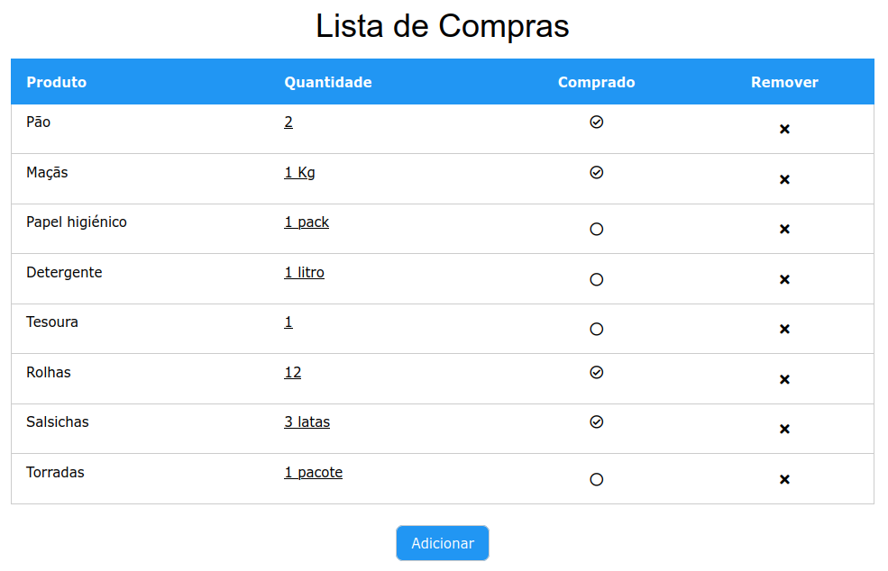
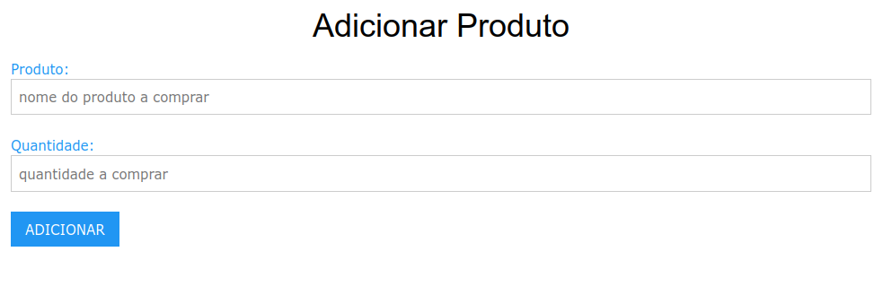
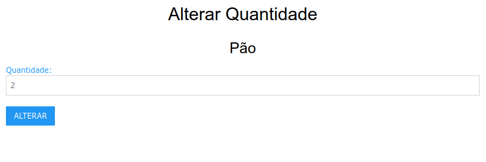

# lista_de_compras

Uma app muito simples para adquirir experiência em Python e Flask

## Objectivo

Ter uma página web que mostra uma lista de artigos para comprar,
respectivas quantidades e uma indicação para cada artigo se já foi ou não
comprado.

Esta lista deve ser armazenada numa base de dados local.

Deve ser possível:

- adicionar artigos, especificando a respectiva quantidade
- remover artigos
- marcar artigos como comprados



## Implementação

Criar e activar um virtual environment (estou a usar Ubuntu Linux):

```
mkdir lista_de_compras
python -m virtualenv lista_de_compras
source lista_de_compras/bin/activate
```

Instalar as libraries de flask (web server) e sqlite (base de dados):

```
pip install flask
pip install db-sqlite3
```

Criar uma base de dados em formato sqlite3 chamada 'database.db' com uma tabela 'ARTIGOS'
com 3 campos:

- 'nome' [TEXT]
- 'quantidade'  [TEXT]
- 'estado' [INTEGER]

(eu usei uma extensão do vscode para o fazer)

Criar um ficheiro 'app.py' que implementa um web server em flask e gere as conexões
à base de dados.

Criar uma pasta 'templates' onde ficarão as páginas HTML servidas:

-  "index.html" - a página principal que mostra a lista
-  'adicionar.html' - um formulário para adicionar um novo artigo à lista
-  'alterarqtd.html' - um formulário para alterar a quantidade pretendida de um artigo

Podia ser crida também uma pasta 'static' contendo ficheiros de estilos (CSS) para
embelezar as páginas mas optei por utilizar [W3-CSS](https://www.w3schools.com/w3css/default.asp)
directamente inline (ou seja é necessário acesso à internet durante a execução do web server).


## Utilização

Iniciar o web server:

`python app.py`

deverá surgir uma mensagem do género:

```
 * Serving Flask app 'app'
 * Debug mode: off
WARNING: This is a development server. Do not use it in a production deployment. Use a production WSGI server instead.
 * Running on http://127.0.0.1:5000
```

e podemos aceder à web app pelo link [http://127.0.0.1:5000](http://127.0.0.1:5000)


## Explicação

### a página principal

A página principal ('index.html') constrói uma tabela HTML com todos os items
da tabela ARTIGOS na base de dados.


Esta tabela tem 4 colunas:

- 'Produto'
- 'Quantidade'
- 'Comprado'
- 'Remover'

As primeiras duas colunas são preenchidas com os campos 'nome' e 'quantidade'
de cada item vindo da base de dados, sendo adicionado um link às quantidades
para permitir ser depois alterados.

A terceira coluna ('Comprado') é preenchida conforma o valor do campo
'estado' do item - se for '1' exibe um estado 'checked' e se for '0' 
exibe um estado 'not checked' a que acresecenta um link para poder ser
alterado o estado (apenas é possível alterar para 'checked').

A quarta coluna é sempree prenchida um link que permite remover o item da
base de dados.


### a página de adição de artigos

Esta página ('adicionar.html') exibe um formulário HTML que pede
duas entradas de texto:

- 'Produto'
- 'Quantidade'



Estes valores são usados para criar um novo item na base de dados
(sempre na tabela ARTIGOS) sendo feito o seguinte mapeamento:

- 'nome' é preenchido com o texto vindo de 'Produto'
- 'quantidade' é preenchido com o texto vindo de 'Quantidade'
- 'estado' é sempre preenchido com '0' (not checked)


### a página de alteração de quantidades

Esta página ('alteraqtd.html') mostra a quantidade actualmente
requerida para o item e exibe um formulário HTML que pede uma
entrada de texto:

- 'Quantidade'



este valor é usado para um update ao campo 'quantidade' do item
na base de dados.


## Ainda por fazer

- melhorar a explicação


## Notas

A lógica da aplicação é extremamente básica, sem validações.

Por exemplo se forem adicionados à lista de compras dois items
com o mesmo nome (por exemplo 'Leite 1 litro' e 'Leite 2 litros')
e for marcado um deles como comprado o outro também será.

Da mesma forma se for apagado um o outro também será.
